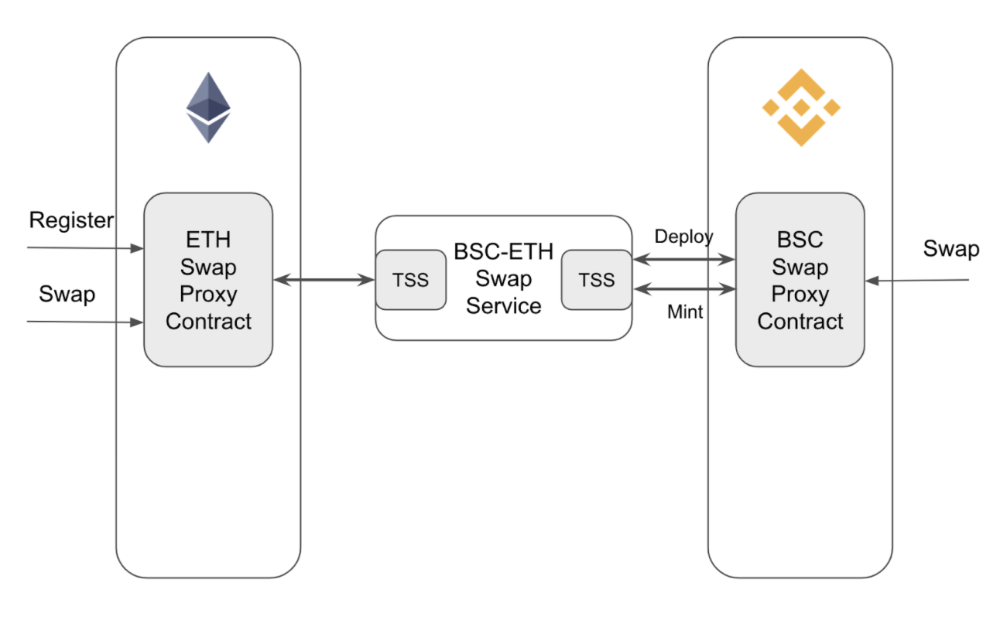

# ETH BSC Swap Contracts

## Overview
ETH BSC Swap Contracts are responsible for registering swap pairs and swapping assets between ETH and BSC.



### Register swap pair

1. Users register swap pair for erc20 token on ETH via ETHSwapAgent(`createSwapPair`) if token is not registered.
2. Swap service will monitor the `SwapPairRegister` event and create swap pair on BSC: 
    
    1. create an BEP20 token on BSC
    2. record the relation between erc20 token and bep20 token.

### Swap from ETH to BSC

Once swap pair is registered, users can swap tokens from ETH to BSC.

1. Users call `swapETH2BSC` via ETHSwapAgent and specify erc20 token address, amount and swap fee.
2. Swap service will monitor the `SwapStarted` event and call `fillETH2BSCSwap` via BSCSwapAgent to mint corresponding bep20
tokens to the same address that initiate the swap.

### Swap from BSC to ETH

Once swap pair is registered, users can swap tokens from BSC to ETH.

1. Users call `swapBSC2ETH` via BSCSwapAgent and specify bep20 token address, amount and swap fee. Bep20 tokens will be burned.
2. Swap service will monitor the `SwapStarted` event and call `fillBSC2ETHSwap` via BSCSwapAgent to transfer corresponding erc20
   tokens to the same address that initiate the swap.

## Environment

1. Make a copy of `.env.template` named `.env`

2. Replace the `YOUR_INFURA_KEY` with the Infura API key of yours.

3. Put the private keys in OWNER_PRIVKEY and ADMIN_PRIVKEY fields.

* OWNER_PRIVKEY is the key of the account deploying the smart contracts. This key will be used in backend to call the smart contract.
* ADMIN_PRIVKEY is the key of the admin account of the proxy contract.

Please keep the private keys in safe storage.

4. Put the scanner API keys in ETHERSCAN_API_KEY and BSCSCAN_API_KEY fields.

## Test

Run the development network:

```javascript
npm run testrpc
```

Deploy to development network:

```javascript
npx truffle migrate --reset
```

Run tests:

```javascript
npx truffle test
```

Run coverage:

```javascript
npm run coverage
```

## Deply & Verify

### Deploy

```javascript
npx truffle migrate --network ropsten --reset
```

Please put the registerTx to ETH_REGISTER_TX in .env

```javascript
npx truffle migrate --network bsctestnet --reset
```

BSC DVG token must give a minter role to the deployed BSCSwapAgentUpgradeableProxy contract.

### Verify

```javascript
npx truffle run verify ETHSwapAgentImpl --network ropsten
npx truffle run verify ETHSwapAgentUpgradeableProxy --network ropsten

npx truffle run verify BEP20TokenImplementation --network bsctestnet
npx truffle run verify BSCSwapAgentImpl --network bsctestnet
npx truffle run verify BSCSwapAgentUpgradeableProxy --network bsctestnet
```
